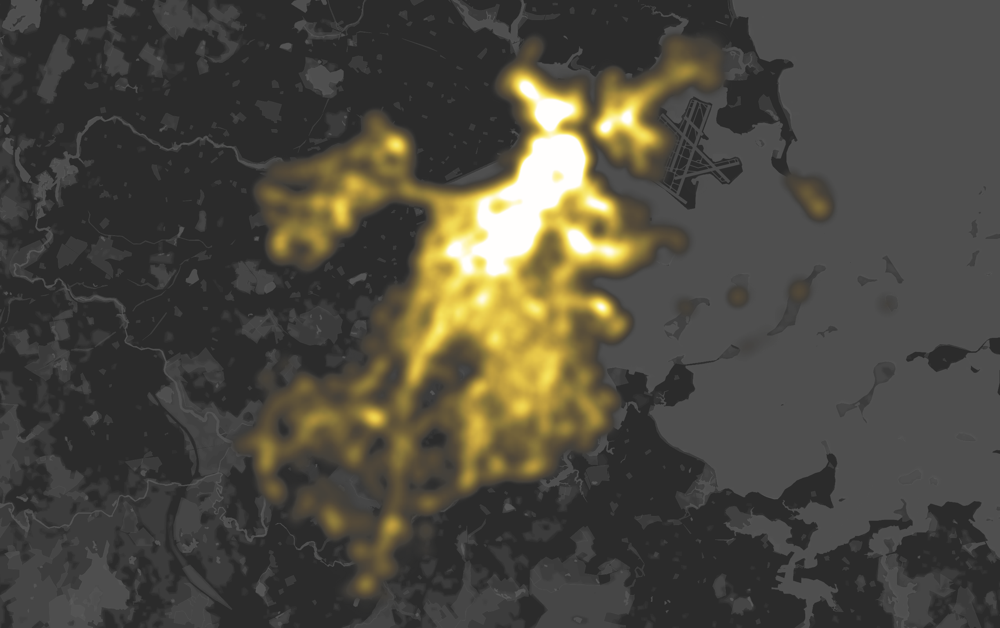
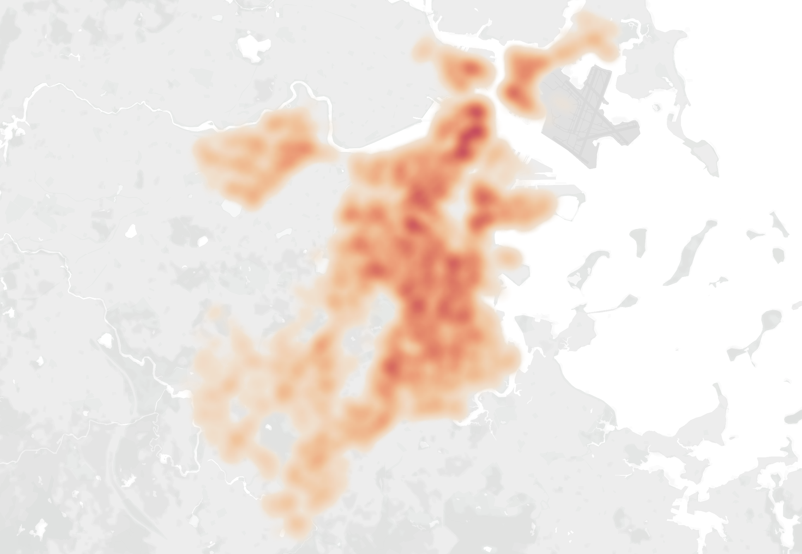

# Final Project: Part II - Wireframes, Storyboards, and User Research

## 1. Wireframes and Storyboards

### Storyboard Overview
The story of this project explores the impact of streetlight installations on crime patterns in urban areas. The narrative guides readers through a data-driven journey, starting with the motivation behind the analysis, diving into the methodology, and concluding with findings and recommendations. The storyboard ensures that every data visualization aligns with the story and enhances its clarity.

---

## 2. Data Visualizations

### Data Visualization Approach
Each data visualization has been created using mock data to illustrate its form and function within the project narrative. Below is the rationale for including these visualizations:
- **Line Chart:** Captures the changes in crime rates based on time of day.
- **Heatmap:** Highlights spatial differences in crime density, allowing for a visual comparison of areas before and after intervention.
- **Buffer Zone Map:** Focuses on micro-level changes in crime around specific streetlight installations.

### Sketches
The sketches were refined into drafts using Tableau. Key elements such as titles, annotations, legends, captions, and axis labels were included to ensure clarity and storytelling consistency.

---

## 3. User Research and Protocol

### Target Audience
The primary audience includes:
1. Urban planners
2. Public safety officials
3. Data enthusiasts interested in urban infrastructure and safety.

### Approach to Identifying Representative Individuals
To ensure diverse perspectives, I conducted interviews with:
- **Urban Planning Graduate Student (20s):** Represents individuals interested in urban design.
- **City Official (40s):** Brings expertise in public safety and policy-making.
- **Data Analyst (30s):** Focuses on storytelling with data visualizations.

### Interview Script
The following questions were asked during the interviews:
1. What stands out to you in the visualizations?
2. Is the purpose of each visualization clear? If not, why?
3. Are there any parts of the story that feel incomplete or unclear?
4. How do you interpret the relationship between streetlights and crime in the data presented?
5. What would make the visualizations or narrative more engaging or informative?

---

## 4. User Research Findings

### Key Insights and Observations
- **Clarity of Visualizations:**
  - The line chart was well-received, but one interviewee suggested adding a label directly on the vertical marker for clarity.
  - The heatmap was considered visually striking but lacked sufficient context without a legend explaining intensity levels.
- **Narrative Flow:**
  - All participants found the narrative logical but suggested moving the demographic context (choropleth map) earlier in the story to set the stage.
- **Interactivity:**
  - Two participants recommended adding filters for time and crime type to allow readers to explore the data interactively.
- **Choropleth Map:**
  - One participant noted that combining population density and crime rates in a single visualization was slightly confusing. Separating them into two graphs was suggested.

### Key Quotes
- "The line chart is intuitive but could benefit from more direct labeling on the intervention marker."
- "The heatmap is great at showing spatial differences, but I wish I could filter it by crime type."
- "Demographic context is essential, but placing it earlier in the story would help frame the problem better."

### Planned Changes
Based on feedback, the following changes will be implemented:
1. Add a direct label to the intervention marker in the line chart.
2. Include a legend for the heatmap to clarify the intensity scale.
3. Separate population density and crime rates in the choropleth map into two visualizations.
4. Explore adding interactivity to the visualizations in Tableau, such as time and crime type filters.
5. Adjust the narrative flow to present demographic context earlier in the story.

---

## 5. Updated Storyboard

### Revised Narrative Flow
1. Introduction: Introduce the relationship between streetlights and crime.
2. Demographic Context: Present choropleth maps to set the stage.
3. Analysis:
   - Line chart showing temporal trends.
   - Heatmap for spatial changes in crime density.
   - Buffer zone analysis for localized impacts.
4. Conclusion: Summarize findings and provide recommendations.

---

## 6. GitHub Navigation

The updated project repository includes:
- **Markdown File:** `final_project_part2.md` with all required sections.
- **Shorthand Draft Link:** [Shorthand](https://app.shorthand.com/organisations/JSrgFWI7zn/stories/6S2vRbIyvZ#section-Guardians-of-the-Reef-H7UCPc5W15)
---

## 7. References

- Zahed, Hasti. "How Does Streetlighting Impact Night Crime?" [Study](https://newsletter.economics.utoronto.ca/wp-content/uploads/How-Does-Streetlighting-Impact-Night-Crime-1.pdf)
- Example Crime Data Sources:
  - [NYPD Crime Data](https://data.cityofnewyork.us/)
  - [Chicago Crime Data](https://data.cityofchicago.org/)
- Example Streetlight Data Sources:
  - [Los Angeles Streetlight Data](https://data.lacity.org/)
  - [San Francisco Streetlight Data](https://data.sfgov.org/)
